# Madraza — Plataforma Educativa de Exámenes

Madraza es una plataforma web educativa que permite a estudiantes, docentes, centros educativos y opositores crear, compartir y realizar exámenes de forma online. Incluye un sistema de suscripciones, organizaciones, apuntes colaborativos y un asistente de IA integrado.

## Acceso en producción

**Aplicación:** [https://madraza.vercel.app](https://madraza.vercel.app)

> Madraza es una **Progressive Web App (PWA)** — puede instalarse en cualquier dispositivo (móvil, tablet o escritorio) directamente desde el navegador, sin necesidad de pasar por una tienda de aplicaciones. Funciona sin conexión gracias al Service Worker integrado.

---

## Capturas de pantalla

### Página de inicio

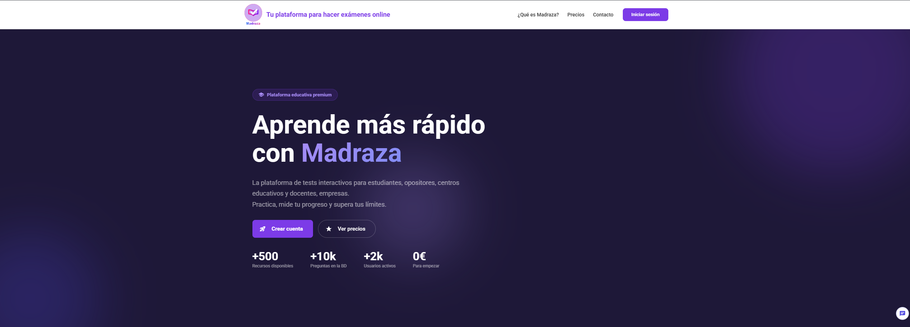


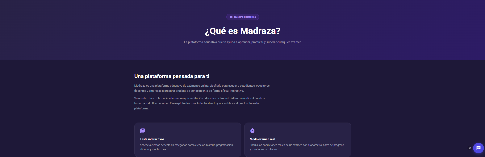

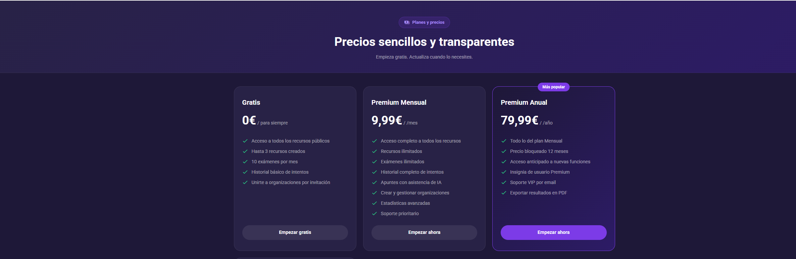


### Navegación


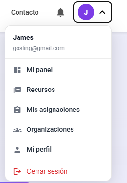
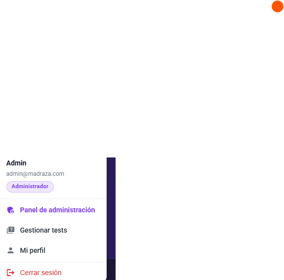
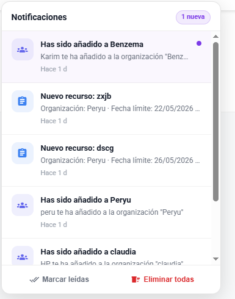

### Autenticación


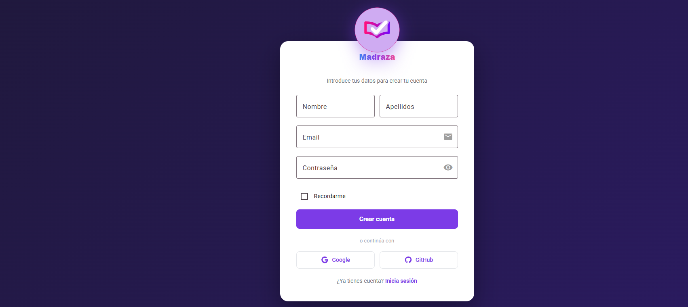
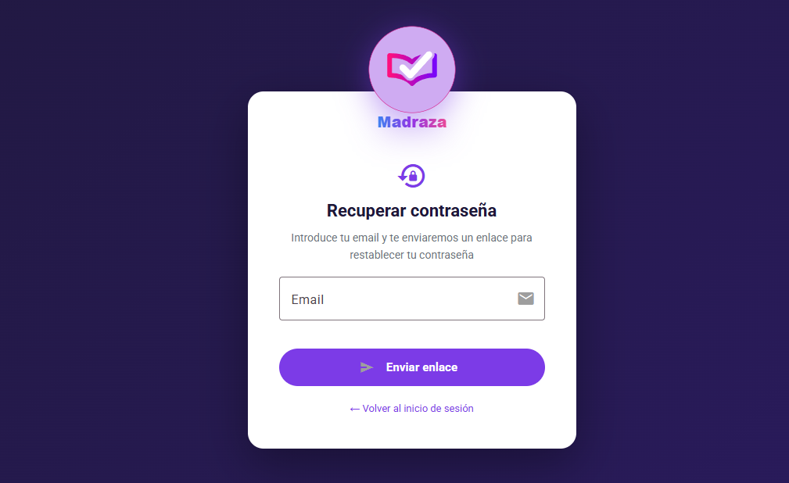


### Precios

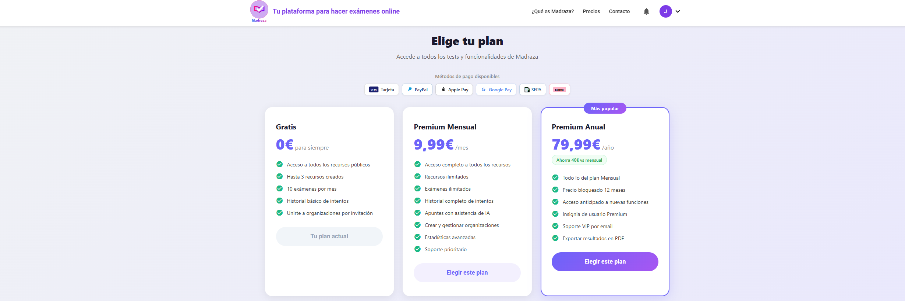
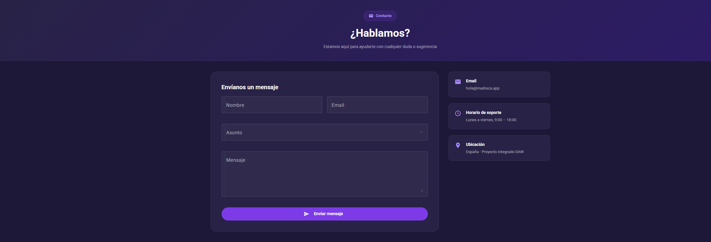

### Dashboard

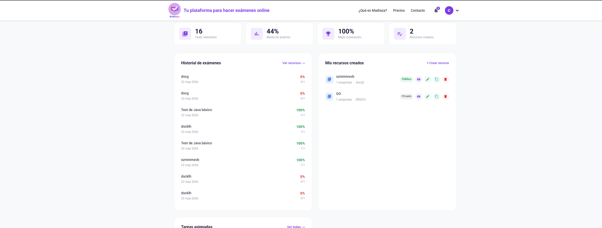
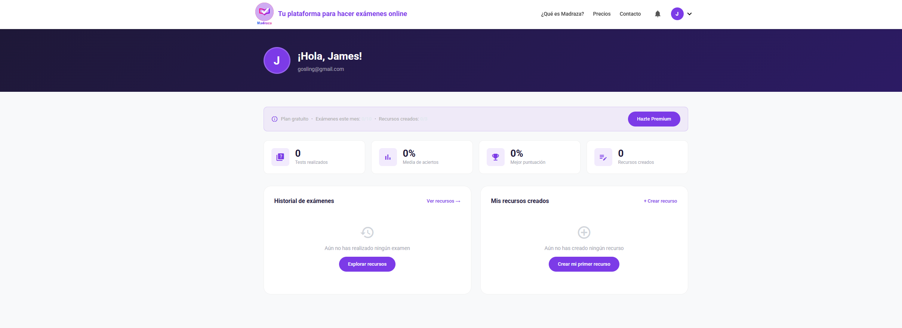
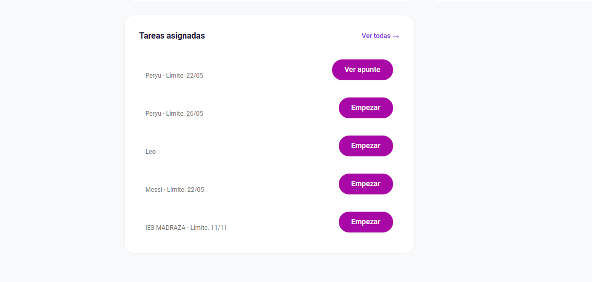

### Tests

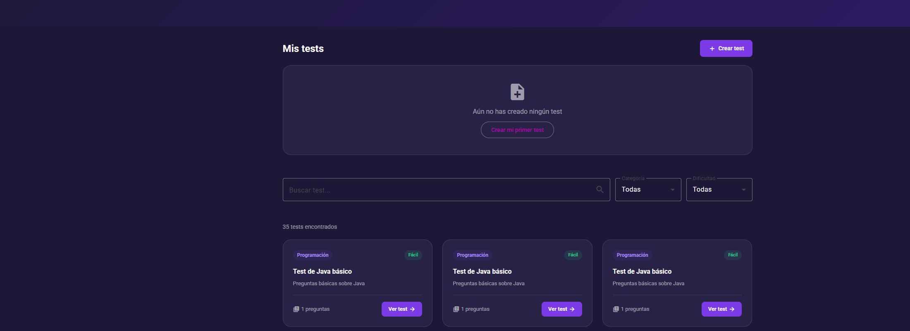
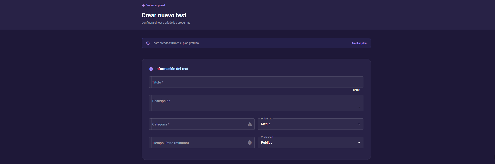
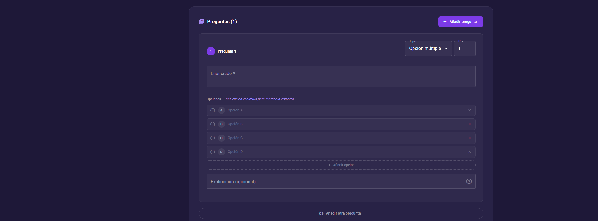

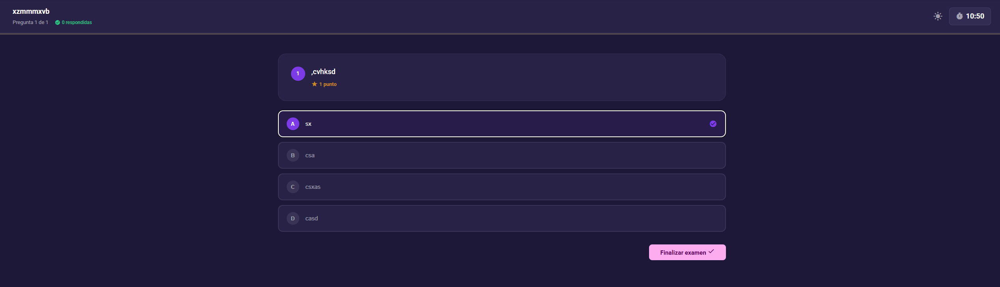
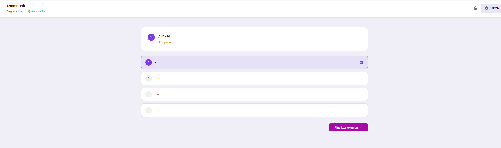


### Apuntes

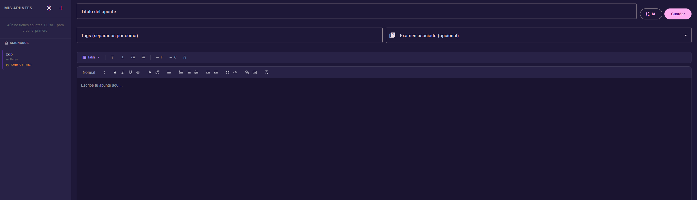
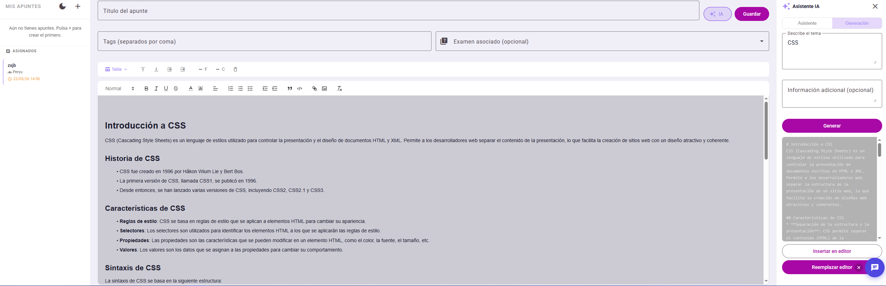
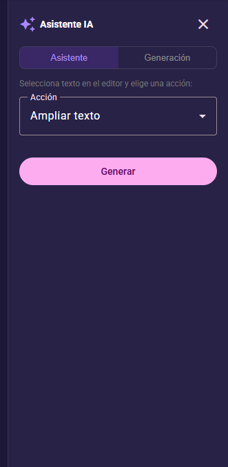
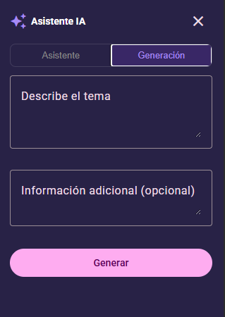

### Organizaciones


### Perfil de usuario

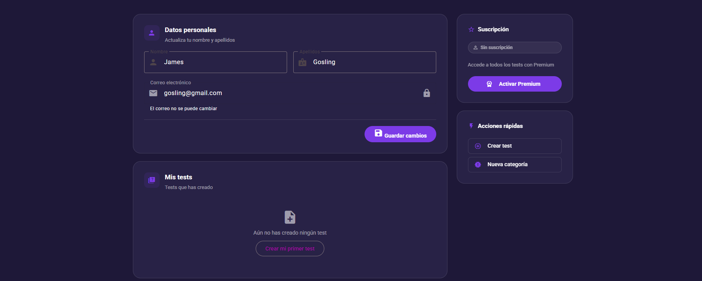
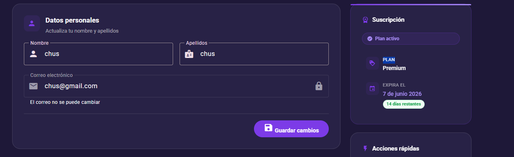

### Panel de administración

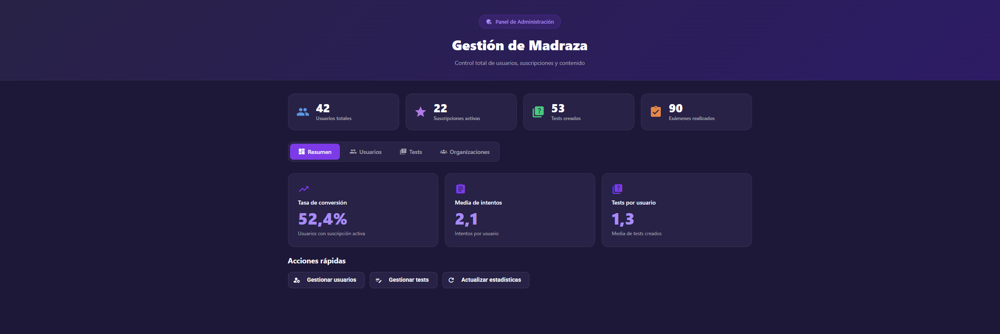
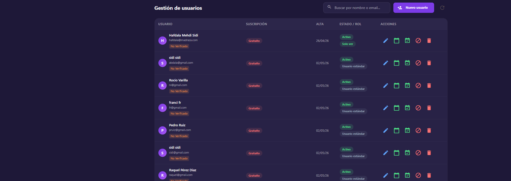
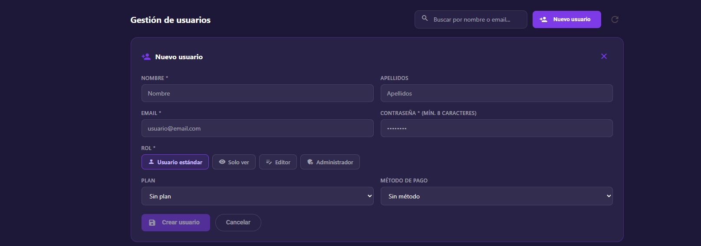
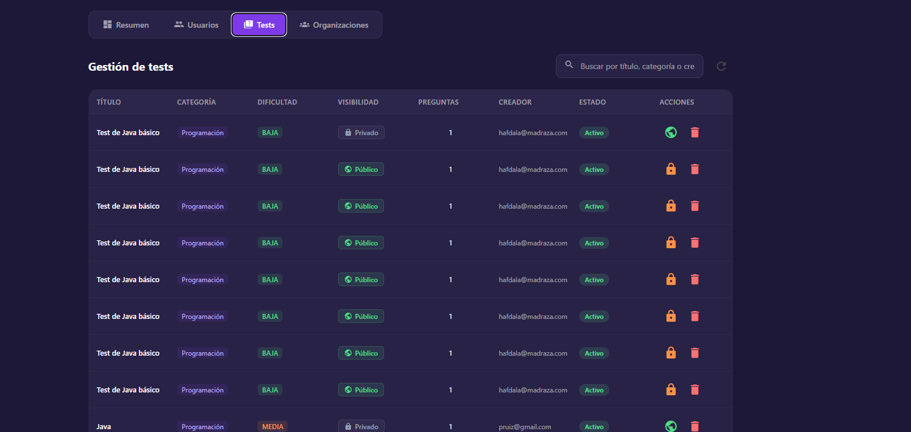
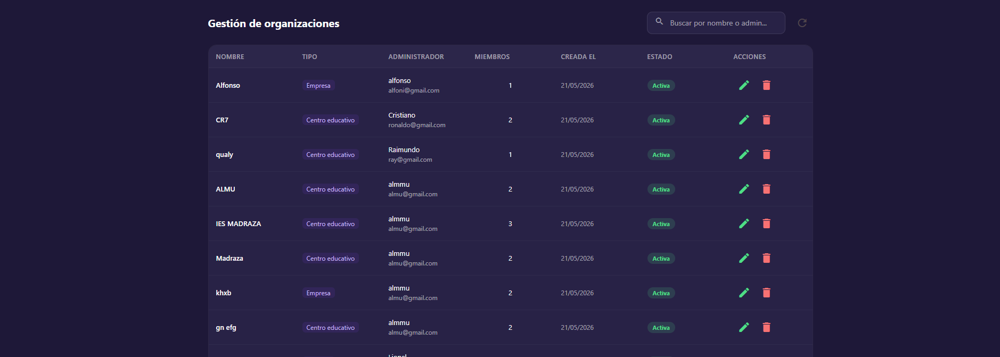
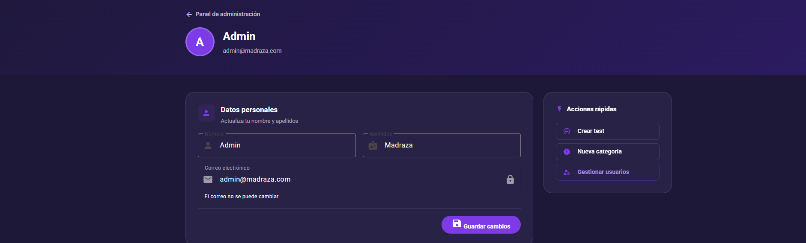

---

## Tecnologías

### Frontend
- **Angular 20** — standalone components, zoneless change detection
- **Angular Material** — UI components con tema oscuro personalizado
- **SCSS** — estilos modulares por componente
- **Stripe.js** — integración de pagos en el cliente
- **PWA** — soporte offline con Service Worker

### Backend
- **Spring Boot 3** — API REST
- **Spring Security + JWT** — autenticación stateless
- **OAuth2** — login con Google y GitHub
- **Spring Data JPA + Hibernate** — persistencia
- **MySQL** — base de datos relacional
- **Thymeleaf** — plantillas de email HTML
- **iText html2pdf** — generación de PDFs
- **Stripe API** — gestión de suscripciones
- **Groq / Llama 3.3** — IA para el asistente virtual

---

## Funcionalidades

- Registro, login con email/contraseña y OAuth2 (Google, GitHub)
- Verificación de email y recuperación de contraseña
- Creación de tests con preguntas de opción múltiple, verdadero/falso y texto libre
- Corrección manual de respuestas de texto libre con anotaciones y nota numérica
- Historial de intentos y estadísticas de resultados
- Exportación de resultados y apuntes a PDF
- Apuntes con editor de texto enriquecido (Quill) y asistente IA
- Organizaciones y centros educativos: gestión de miembros, asignación de tests y apuntes
- Panel de administración completo
- Suscripciones Premium con Stripe (tarjeta, Bizum, Klarna, PayPal, Apple Pay, Google Pay)
- Chat con asistente virtual Madra (IA)
- Diseño responsive y PWA instalable
- Emails transaccionales: confirmación de registro, pago, recuperación de contraseña, invitaciones

---

## Estructura del proyecto

```
proyecto_madraza/
├── Backend/          # Spring Boot — API REST
│   └── src/
│       ├── main/java/com/madraza/
│       │   ├── controller/
│       │   ├── service/
│       │   ├── entity/
│       │   ├── repository/
│       │   ├── security/
│       │   └── config/
│       └── test/
└── Frontend/         # Angular 20 — SPA
    └── src/app/
        ├── core/         # servicios, guards, modelos
        ├── features/     # componentes por funcionalidad
        └── shared/       # componentes reutilizables
```

---

## Instalación y ejecución en local

### Requisitos previos
- Java 21
- Node.js 20+
- pnpm
- MySQL 8

### Backend

```bash
# 1. Crear base de datos
mysql -u root -p -e "CREATE DATABASE madraza;"

# 2. Configurar application-dev.properties con tus credenciales locales

# 3. Arrancar con perfil dev
cd Backend
mvn spring-boot:run -Dspring-boot.run.profiles=dev
```

### Frontend

```bash
cd Frontend
pnpm install
pnpm start
```

La aplicación estará disponible en `http://localhost:4200`.

---

## Variables de entorno (producción)

| Variable | Descripción |
|---|---|
| `DATABASE_URL` | URL de conexión a MySQL |
| `DATABASE_USERNAME` | Usuario de la base de datos |
| `DATABASE_PASSWORD` | Contraseña de la base de datos |
| `JWT_SECRET` | Clave secreta para firmar JWT |
| `MAIL_USERNAME` | Cuenta Gmail para envío de emails |
| `MAIL_PASSWORD` | App Password de Gmail |
| `MAIL_FROM` | Dirección remitente |
| `STRIPE_SECRET_KEY` | Clave secreta de Stripe |
| `STRIPE_WEBHOOK_SECRET` | Secret del webhook de Stripe |
| `STRIPE_PRICE_MENSUAL` | ID del precio mensual en Stripe |
| `STRIPE_PRICE_ANUAL` | ID del precio anual en Stripe |
| `GOOGLE_CLIENT_ID` | Client ID de Google OAuth2 |
| `GOOGLE_CLIENT_SECRET` | Client Secret de Google OAuth2 |
| `GITHUB_CLIENT_ID` | Client ID de GitHub OAuth2 |
| `GITHUB_CLIENT_SECRET` | Client Secret de GitHub OAuth2 |
| `GROQ_API_KEY` | Clave de API de Groq (IA) |
| `FRONTEND_URL` | URL pública del frontend |

---

## Tests

### Backend (JUnit 5 + Mockito)

```bash
cd Backend
mvn test
```

### Frontend (Karma + Jasmine)

```bash
cd Frontend
pnpm test
```

---

## Autor

**Hafdala Mehdi Sidi**
Proyecto Integrado — 2º DAW · 2025/2026

- Email: [madrazaapp@gmail.com](mailto:madrazaapp@gmail.com)
- GitHub: [MadrazaDigitalSchool](https://github.com/MadrazaDigitalSchool)
- Instagram: [@madrazaapp](https://www.instagram.com/madrazaapp/)
- LinkedIn: [madraza](https://www.linkedin.com/in/madraza)
